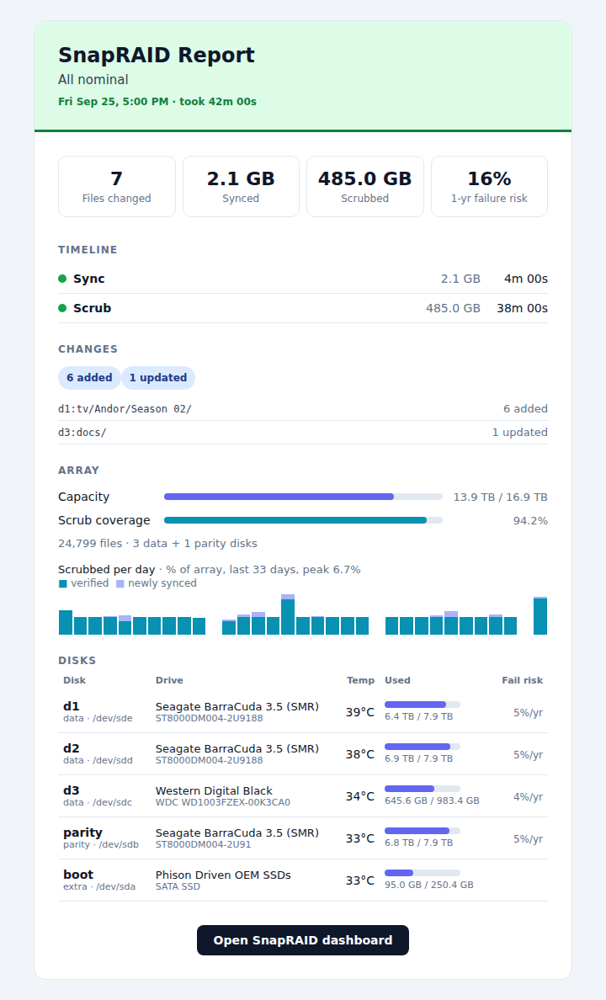
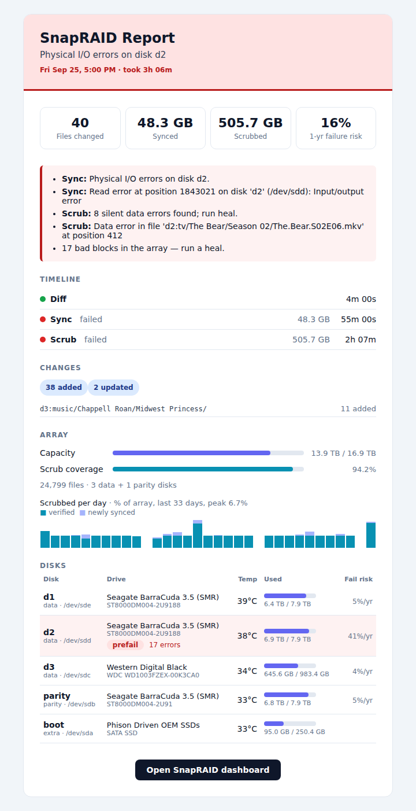
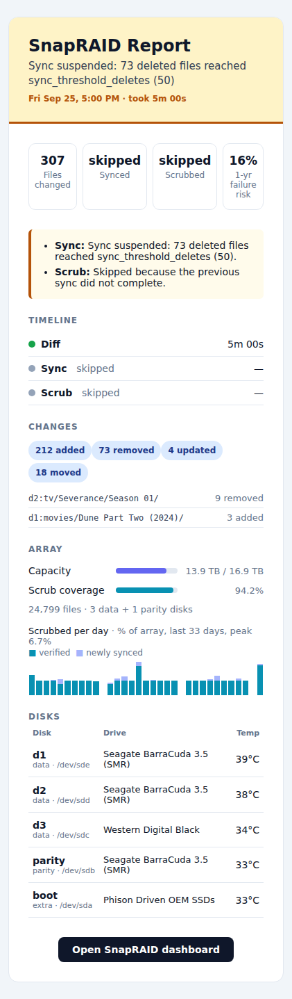

# snapraid-report

Daily HTML email summarising the latest [snapraid-daemon](https://www.snapraid.it) (`snapraidd`) run.

The report is built from the daemon's REST API and covers:

- **Headline stats** — files changed, data synced and scrubbed, and the daemon's estimate of a disk failing within a year
- **Issues** — failed or skipped steps, I/O and silent data errors, bad blocks
- **Timeline** — the run's sync/scrub steps with sizes and durations
- **Changes** — added/removed/updated files, grouped by folder
- **Array** — capacity, scrub coverage, and daily scrub history
- **Disks** — drive, temperature, fill, failure risk, and health

The email's level (✅ / ⚠️ / ❌) comes from the run's results. A run that's still going, a missed run (none since the daemon's last `maintenance_schedule` time, or in the last 24 hours without a schedule), an unreachable daemon, and a report that fails to build are all reported too.

## Screenshots

<table>
  <tr>
    <th>All good</th>
    <th>Errors</th>
    <th>Warning, on a phone</th>
  </tr>
  <tr>
    <td valign="top"></td>
    <td valign="top"></td>
    <td valign="top"></td>
  </tr>
</table>

The screenshots come from `preview/preview.py`, which uses real array and disk data with made-up runs.

## Requirements

- `snapraidd` with its REST API enabled (`net_enabled = 1` in `/etc/snapraidd.conf`)
- Python 3.11+ and [uv](https://docs.astral.sh/uv/)
- A working `sendmail` (e.g. Postfix)

## Setup

```sh
uv sync --no-dev                                       # jinja2 + css-inline into .venv/
cp snapraid-report.conf.example snapraid-report.conf   # then fill in [mail] to/from
uv run snapraid-report.py --dry-run                    # print the email instead of sending it
```

`snapraid-report.conf` is gitignored. Pass `--config PATH` to use a file elsewhere, and `--to ADDRESS` to send a one-off copy somewhere else.

Run it from cron a few hours after the daemon's `maintenance_schedule`:

```cron
0 8 * * * /path/to/snapraid-report/.venv/bin/python /path/to/snapraid-report/snapraid-report.py 2>&1 | logger -t snapraid-report
```

Errors land in syslog: `journalctl -t snapraid-report`.

## Templates

The email is `templates/report.html.j2` (Jinja2), with shared pieces in `templates/macros.html.j2` and styles in `templates/report.css`. The stylesheet is written normally, with classes. When the email is built, [css-inline](https://github.com/Stranger6667/css-inline) copies every rule into inline `style` attributes, since most email clients ignore `<style>` blocks; the phone-width `@media` rules stay in a `<style>` tag for the clients that support them. State shows up as class names (`level-warning`, `dot-failed`, `temp-hot`, …), so colors are only ever set in the stylesheet.

`snapraid-report.py` gathers the data and hands the template a typed `Report` built by `build_report`, with one builder per template section. Numbers are formatted by the same functions in Python and in the template, which gets them as filters (`number`, `percent`, `bytes`, `duration`).

## Previewing layout changes

`preview/preview.py` renders every kind of report (all good, warning, error, still running, missed run) by swapping fake task history into the live daemon's array and disk data:

```sh
uv run preview/preview.py            # HTML + desktop/phone screenshots in preview/out/
uv run preview/preview.py --no-png   # HTML only
uv run preview/preview.py --send     # email them, subjects prefixed EXAMPLE
```

The README's screenshots in `docs/` are copies of `info-desktop.png`, `error-desktop.png` and `warning-phone.png` from a preview run.

Screenshots use Playwright (a dev dependency) and its headless Chromium: `uv run playwright install --only-shell chromium`. On a minimal server it may also need a few shared libraries (ATK, AT-SPI, Xcomposite, Xdamage) and `fonts-noto-color-emoji` for the subject icons.

## Checks

```sh
uv run ruff check .   # lint
uv run ty check       # types
```
